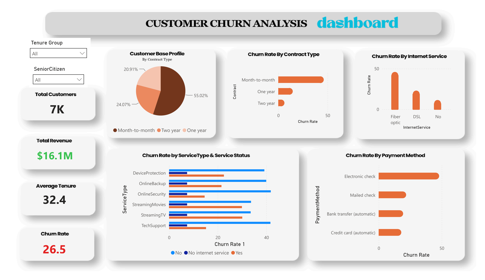

# Customer-Churn-Analysis

## Overview
A full-cycle business analytics case study investigating customer churn for a telecommunications provider (ABC Communications Ltd, case study framing). The project covers data inspection and cleaning, exploratory analysis, visualization, and translates findings into concrete retention recommendations for management.

## Business Questions
- What does the customer base look like?
- Which segments have the highest churn?
- Does contract type influence retention?
- Does tenure affect loyalty?
- Which services influence churn?
- Which payment methods have higher churn?
- What actions should management take?

## Tools Used
- Microsoft Power BI for cleaning, reference-query unpivoting on power query, DAX measures for calculations & visualizations.
- Microsoft Word for business understanding report, dataset inspection report
- Microsoft PowerPoint for executive business presentation
- Dataset ~ Telco Customer Churn (Kaggle)

## Key Findings
- Overall churn rate: 26.5% (1,869 of 7,043 customers)
- Contract type is the strongest churn driver. 42.7% (month-to-month) vs. 2.8% (two-year), a 15x gap
- Highest-risk combined segment: Fibre optic + Electronic check. 53.2% churn (1,595 customers, 22.6% of the base)
- Tenure predicts loyalty almost linearly. Churn falls from 47.4% (0–12 months) to 6.6% (61–72 months)
- Support services build retention. No Online Security/Tech Support nearly triples churn (~41% vs ~15%)
- Senior citizens are vulnerable to churn as they are underserved.

## Recommendations (Summary)
- Targeted retention campaign for the Fibre + Electronic Check segment (auto-pay incentive)
- First-90-days onboarding program for new month-to-month customers
- Default-include security/support services on fiber plans
- Dedicated senior-citizen retention track
- Incentivized upgrades from month-to-month to annual/two-year contracts
